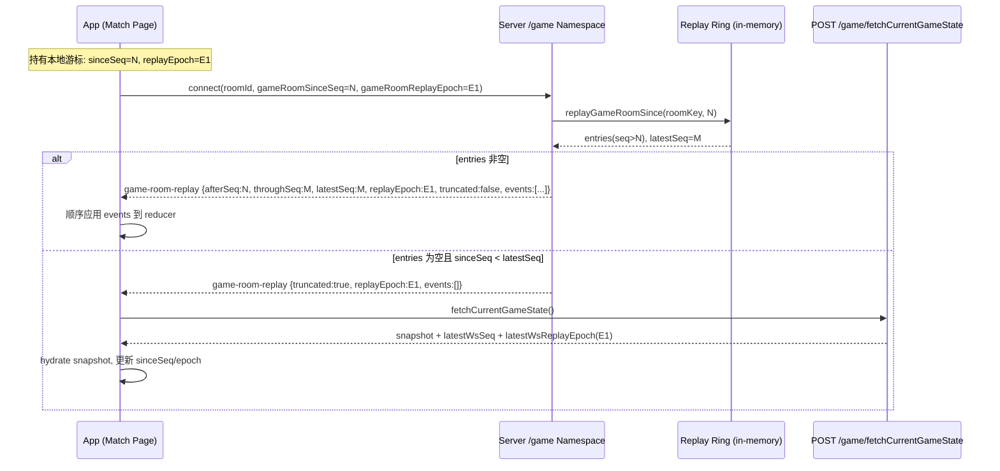
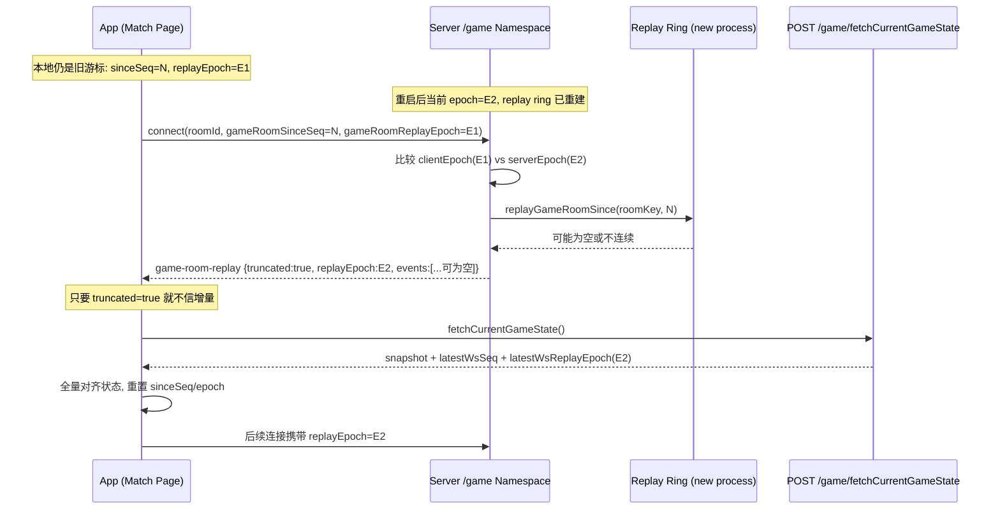

# Game Reconnect Sequence

本文描述当前「对局页断线重连」链路，重点说明 `gameRoomSinceSeq` 与 `replayEpoch` 的协作。

## 1) 正常断线重连（同一服务进程）

## 2) 服务重启后重连（epoch 不一致）

## 字段职责

- `gameRoomSinceSeq`: 客户端声明「已处理到的全房 WS 序号」。
- `replayEpoch`: replay 缓冲世代标识。服务进程重启后变化，用于识别“跨世代游标”。
- `truncated=true`: 增量不可可信（缓冲被挤出或 epoch 不一致），客户端必须走 HTTP 快照对齐。

## 客户端落地策略

1. 先尝试消费 `game-room-replay.events`（若有）。
2. 如果 `truncated=true`，立即 `fetchCurrentGameState`。
3. 用快照覆盖本地状态，并更新 `sinceSeq` + `replayEpoch`。
4. 后续增量继续以新游标工作。
