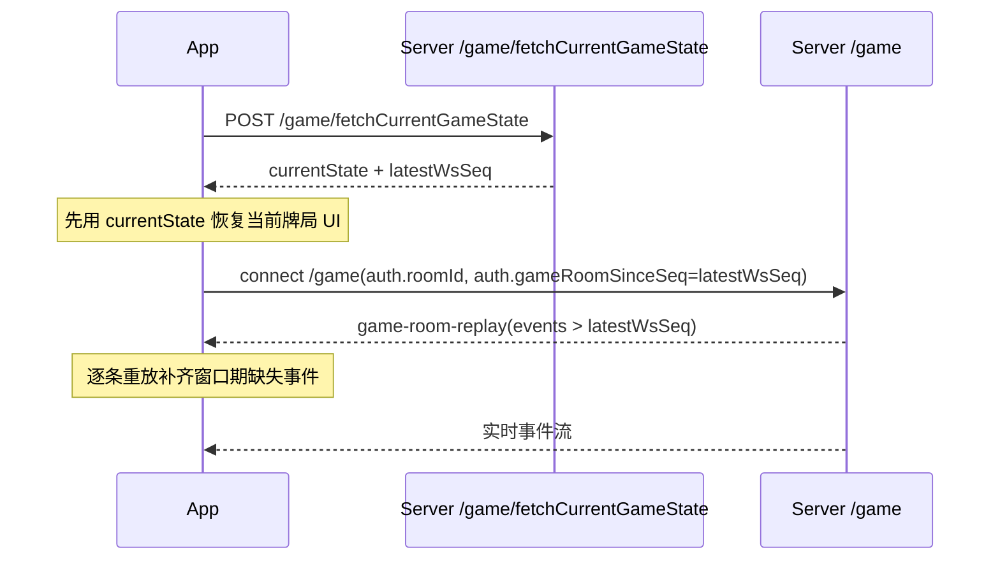

# WS 事件参考（给 App）

基于 `packages/texas-ws-contract/index.d.ts` 整理。

## 消息包格式

所有 WS 消息统一结构：

```ts
type WsMessage<T extends WsEventType = WsEventType> = {
  type: T
  data: WsEventDataMap[T]
}
```

## 共享类型说明

- `Poke`: 牌面标识（来自 `texas-poker-core`）
- `RoleEnum`: 玩家角色（庄家/小盲/大盲等）
- `StageEnum`: 阶段（`pre_flop` / `flop` / `turn` / `river` 等）
- `ActionType`: 玩家行动（`check` / `fold` / `bet` / `raise` / `allIn` / `call`）
- `RankCategory`: 牌型分类

---

## 进入对局流程事件

### `game-entering`

用途：服务端通知房间成员“正在进入对局流程”。

```ts
{
  roomId: number
}
```

### `game-entering-progress`

用途：进入流程中的连接进度（用于 App 显示谁已连上 `/game`）。

```ts
{
  roomId: number
  expectedUserIds: number[]
  connectedUserIds: number[]
}
```

### `game-entered`

用途：进入成功并创建首手对局。

```ts
{
  roomId: number
  matchId: number
  userIds: number[]
}
```

### `game-entering-resolved`

用途：连接超时后的最终决策（回退等待房 or 销毁房间）。

```ts
{
  roomId: number
  outcome: 'back_waiting_room' | 'destroy_room'
  connectedUserIds: number[]
  kickedUserIds: number[]
  ownerId: number | null
}
```

---

## 对局生命周期事件

### `player-roles-assigned`

用途：本手角色分配完成（庄/盲位等）。不含阶段字段；阶段在收到 `game-start` 时由客户端置为 `pre_flop`，后续以 `game-stage-changed` 为准。

```ts
{
  matchId: number
  roles: Array<{
    userId: number
    role: RoleEnum
    actionIndex: number
  }>
}
```

### `player-hand-dealt`

用途：给目标玩家推送其手牌（私牌）。

```ts
{
  matchId: number
  roomId: number
  handPokes: Poke[]
}
```

### `game-start`

用途：本手正式开始（引擎已下盲注等）。不携带 `stage` / `pool`：客户端收到后置阶段为 `pre_flop`；底池可与同批稍后下发的 **`game-blinds-posted`** 或后续 `player-action-taken` 中的 `pool` 对齐。

```ts
{
  matchId: number
}
```

### `game-blinds-posted`

用途：翻前小盲/大盲已从各玩家筹码扣入池（与 Core `BlindsPosted` 一致；短码时 `amount` 可小于规定盲注）。在 `game-start` 之后、`player-action-required` 之前下发。

```ts
{
  matchId: number
  roomId: number
  posts: Array<{ userId: number; amount: number; kind: 'sb' | 'bb' }>
  pool: number
}
```

### `player-action-required`

用途：轮到某玩家行动（包含倒计时、可用动作和限制）。

```ts
{
  matchId: number
  userId: number
  serverNow: number      // 本条 WS 实际发出时刻（ms）；可能与引擎开始计时不一致（例如延迟推送）
  deadlineAt: number     // 与引擎一致的截止绝对时间（ms），在 onPreAction 时确定；剩余请用 deadlineAt - 本地 now
  allowedActions: ActionType[]
  restrict?: {
    min: number
    max: number
  }
}
```

### `player-action-taken`

用途：玩家已执行行动，广播给同桌玩家同步状态。

```ts
{
  matchId: number
  userId: number
  actionType: ActionType
  amount: number
  pool: number
  currentStageBetAmount: number
  balance: number
}
```

### `game-stage-changed`

用途：阶段推进（翻公共牌）。

```ts
{
  matchId: number
  stage: StageEnum
  pokesToReveal: Poke[]
}
```

### `game-end`

用途：本手结束结算。

```ts
{
  matchId: number
  settleList: Array<{
    userId: number
    balance: number
    wager: number
    isAllIn: boolean
    isFold: boolean
    handPokes: Poke[]
    /** 与 handPokes 一致：看他人且（对方弃牌 或 未摊牌）时不出现 */
    rankStrength?: number
    rankCategory?: RankCategory
  }>
  pokesToReveal: Poke[]
  lastActionStage: StageEnum   // 最后一轮可操作下注结束时的阶段（引擎 currentStage）
  boardThroughStage: StageEnum // 公共牌发到哪一街（引擎 endStage）
  bestRankCategory: RankCategory
  /** 与 `bestPokes[0]` 一致（texas-poker-core `RankSignature`）；独赢弃牌等可无 */
  bestRankSignature?: string
  gameDuration: number   // 秒
  bestPokes: Array<Poke[]>
  totalBetAmount: number
}
```

### `player-chip-top-up`

用途：某玩家在**局间**（`between_hands`、引擎 `idle`）补码成功后，向**游戏房**内所有人广播，用于同步该玩家桌上余额与本次补入数量。

触发时机：**仅在本轮请求首次完成「引擎加钱 + DB 写入」时发一次**。若本局间已补过（HTTP 幂等静默成功）或并发下由另一请求先落库，则**不再重复推送**。

```ts
{
  roomId: number
  userId: number // 补码玩家
  afterMatchId: number // 服务端取本房「最近已结束」的 Match.id
  topUpAmount: number // 本次补入筹码，服务端取 `Room.initialChips`
  balanceAfter: number // 补码后该玩家桌上余额（引擎）
}
```

### `players-posted-big-blind`

用途：对局中途加入的玩家入座通知 + 翻前补缴大盲结果。`seatedUserIds` 用于客户端刷新 `playerSet`（拉取成员后更新 UI）；`posts` 用于按行动样式渲染“补缴大盲”下注表现。

```ts
{
  roomId: number
  matchId: number | null
  seatedUserIds: number[]
  posts: Array<{
    userId: number
    amount: number
    balance: number
    totalBetAmount: number
    currentStageBetAmount: number
  }>
  pool: number
}
```

**配套 HTTP**（需登录，路径以项目 `apiPrefixClient` + `/game/chipTopUp` 为准）：

- 方法：`POST`
- Body：`{ roomId: number }`（不传 `matchId`、不传补码数量）
- 成功 `data`：`{ balanceAfter, topUpAmount, afterMatchId, alreadyApplied?: boolean }`
- 规则摘要：`afterMatchId` 为库中该房 `endedAt` 最新的一条 `Match`；须 `between_hands` 且引擎 `idle`；桌上筹码须 ≤ 起始筹码的 20%（`CHIP_TOP_UP_ELIGIBLE_RATIO`）；每 `(roomId, userId, afterMatchId)` 仅允许成功补一次。

---

## 作废与自动续局事件

### `game-invalidated`

用途：**仅**引擎致命错误导致本手作废；服务端已删除该 `matchId` 相关入库数据。客户端应 Toast 提示「对局发生了意料之外的错误，即将返回首页」，约 1.5s 后 `replace` 到首页，**勿**再按本事件恢复桌上状态。人数不足关房见 `game-room-closed`。

```ts
{
  roomId: number
  matchId: number
  reason: string
  source: 'engine_error'
}
```

### `next-hand-countdown-started`

用途：下一手倒计时开始。

```ts
{
  roomId: number
  endsAt: number
  lockAt: number
  serverNow: number
}
```

### `next-hand-countdown-cancelled`

用途：下一手倒计时取消（如人数不足）。

```ts
{
  roomId: number
}
```

---

## 断线重连与中途观战：`game-room-replay`

### `game-room-replay`

仅发往**当前重连的这一条** `/game` 连接（非全房广播）。`data`：

```ts
{
  roomId: number
  afterSeq: number
  throughSeq: number
  latestSeq: number
  truncated?: boolean
  events: Array<{ seq: number; payload: Record<string, unknown> }>
}
```

- **HTTP 快照**（`POST .../game/fetchCurrentGameState`）仍是权威状态；响应内带 **`latestWsSeq`**，表示当前全房广播游标。
- **WS 补发**：连接 `/game` 时在 **`auth.gameRoomSinceSeq`** 传入客户端「最后已处理的全房广播序号」（未收到过则 `0`）。连上后除 `initial connect` 外，可能收到一条 **`game-room-replay`**：
  - `events`：每条为 `{ seq, payload }`，`payload` 与同房间历史 `message` 事件 body 相同（一般为 `{ type, data }`），按 `seq` 顺序重放即可。
  - **`truncated: true`**：`afterSeq < latestSeq` 但环形缓冲里已无中间消息（断线过久或消息过多被挤出）；须先拉 HTTP 快照对齐，再把本地游标设为返回的 `latestSeq`。
- **未入缓冲的消息**：`broadcastGameToUser`（如 `player-hand-dealt`）、`broadcastGameEach` 等**不会**进入环形缓冲，仍依赖快照或既有单播逻辑。

### 中途加入/重连恢复时序



---

## 事件枚举总表

```ts
type WsEventType =
  | 'game-entering'
  | 'game-entering-progress'
  | 'game-entered'
  | 'game-entering-resolved'
  | 'game-invalidated'
  | 'next-hand-countdown-started'
  | 'next-hand-countdown-cancelled'
  | 'player-roles-assigned'
  | 'player-hand-dealt'
  | 'game-start'
  | 'game-blinds-posted'
  | 'player-action-required'
  | 'player-action-taken'
  | 'game-stage-changed'
  | 'game-end'
  | 'player-chip-top-up'
  | 'players-posted-big-blind'
  | 'game-room-replay'
```
